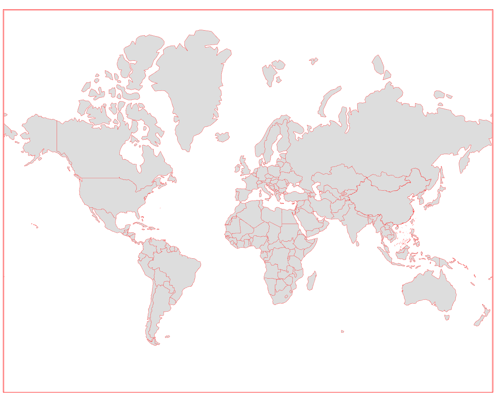

<!--
 * @LastEditTime: 2022-11-15 20:01:19
 * @LastEditors: jinxiaojian
-->
#  Earth world map

### 合规的世界地图
##### 建议使用 wrold4.json

- wrold.json 世界简化
- wrold4.json 世界简化+中国细化
- wrold3.json 世界细化

目前网络上的世界地图,大部分存在合规问题,目前这个是我整理的geo地图,可能会有用https://github.com/jxj666/earthWordMap
**维护国土人人有责**
word4 实例

 建议使用 wrold4.json
wrold.json 世界简化
wrold4.json 世界简化+中国细化
wrold3.json 世界细化
https://github.com/jxj666/earthWordMap
今后应该如何避免“问题地图”的法律风险？
**请审核地图的合规性**
在拿到一份中国地图并使用在互联网广告等公共传播媒介上前，企业主或广告业者至少应当根据自己的常识审核一下该份地图是否符合法律法规的规定。

正确的中国地图与“问题地图”的对比示例：

如上图所示，一份中国地图上的重点区域是否绘制正确，决定了它有没有犯重大错误，是尤其需要**重点关注**的:
西藏西部的阿克赛钦地区
西藏南部的藏南地区
台湾岛东北部的钓鱼岛
台湾岛东北部的赤尾屿
南海诸岛
台湾岛
